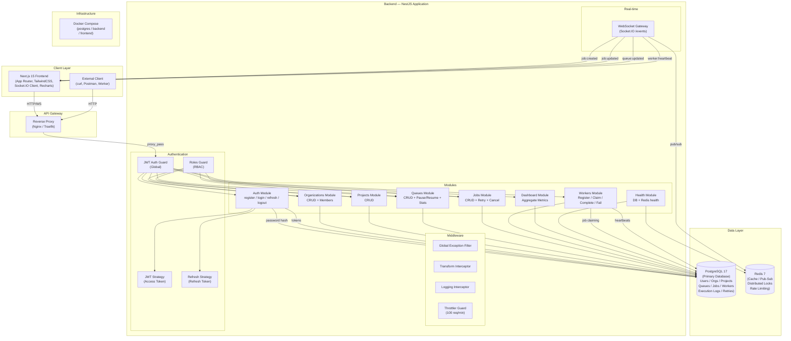

# Architecture Diagram

## Component Descriptions

### Frontend (Next.js 15)
- **App Router** with route groups for auth and dashboard
- **TanStack Query** for server state management with automatic cache invalidation
- **Zustand** for client-side auth state (access token in memory only)
- **Socket.IO Client** for real-time job/queue/worker updates
- **Recharts** for dashboard analytics visualizations

### Backend (NestJS 10)
- **Clean Architecture** with modules, services, controllers, and DTOs
- **Global JWT Guard** — all routes authenticated by default, opt-out via `@Public()`
- **Roles Guard** — RBAC enforcement at the controller level
- **Transform Interceptor** — wraps all responses in `{ success, data, timestamp }` envelope
- **Global Exception Filter** — handles HTTP exceptions and Prisma errors uniformly

### Database (PostgreSQL)
- **Prisma ORM** for type-safe database access and migrations
- **UUID primary keys** for distributed-friendly ID generation
- **Cascade deletes** for clean resource cleanup
- **Composite unique constraints** for multi-tenant slugs and idempotency keys

### Cache (Redis)
- **ioredis** client with connection pooling
- **Pub/Sub** for WebSocket event broadcasting across multiple backend instances
- **Distributed Locking** via SET NX PX (Redlock-compatible pattern)
- **Rate Limiting** via `@nestjs/throttler` backed by Redis (configurable)

### WebSocket Gateway
- **Socket.IO** on `/events` namespace
- **Token-based authentication** via query parameter
- **Organization-scoped rooms** for targeted event delivery
- Emits events: `job:created`, `job:updated`, `queue:updated`, `worker:heartbeat`

### Worker Service
- External process that registers with the API
- Polls for jobs via atomic claim transaction
- Reports heartbeat at regular intervals
- Reports completion or failure with optional result/error payload
- Automatic retry with configurable backoff strategy
- Workers marked OFFLINE after 30s without heartbeat
